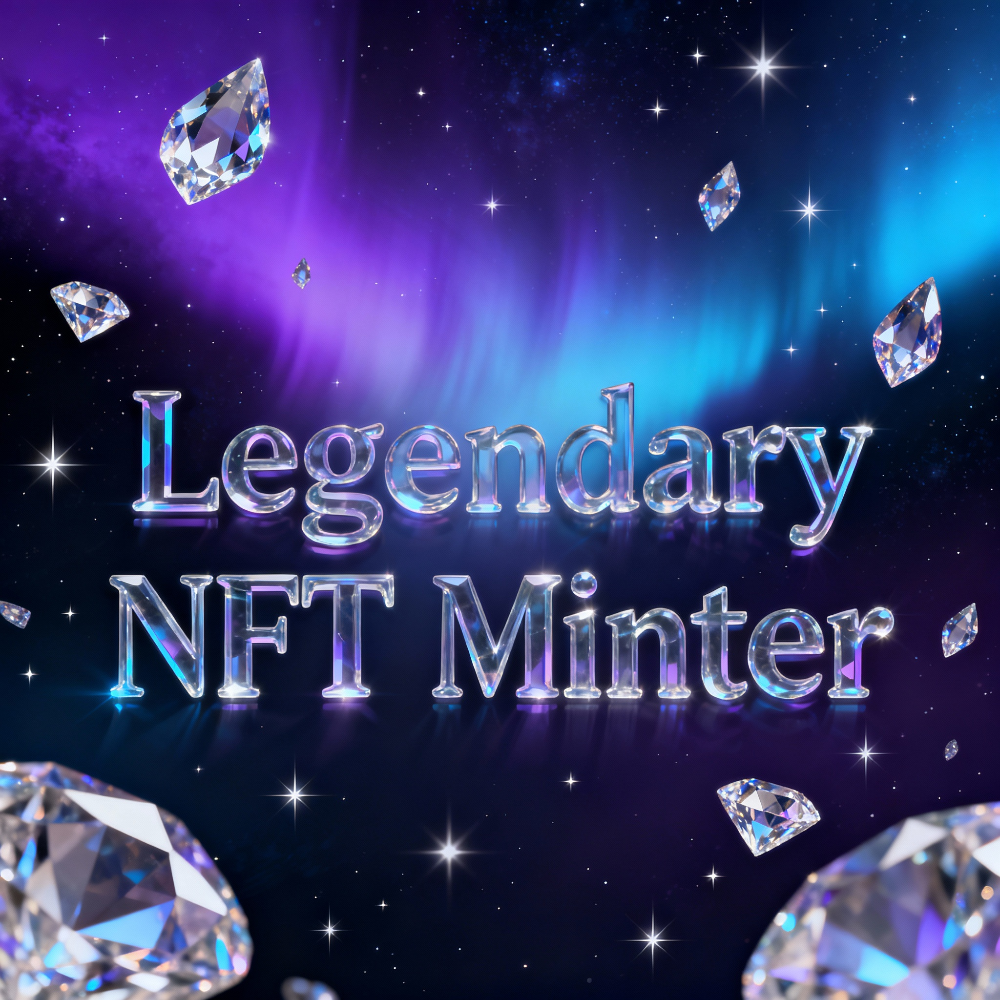

# 💎 NFT Mini App - Legendary Minting Experience

A premium, high-performance NFT minting application built with Vite, Tailwind CSS, and Reown AppKit. Optimized for the Base network and designed to work seamlessly as a Farcaster Frame.



## ✨ Features

- **Legendary UI**: Stunning "Aurora" background effects, glassmorphism, and smooth animations.
- **Universal Mint Policy**: Supports multiple stages including Free Mint, Paid Mint, and dynamic supply checks.
- **Multi-Chain Ready**: Defaulting to **Base**, with support for Base Sepolia testnet.
- **AppKit Integration**: Powered by Reown (formerly Web3Modal) for a seamless wallet connection experience.
- **Farcaster Optimized**: Includes metadata and configurations to run as a V2 Frame/Mini-app.
- **Responsive Design**: Mobile-first layout that looks great on all devices.

## 🚀 Quick Start

### 1. Prerequisites
- [Node.js](https://nodejs.org/) (v18+)
- A WalletConnect Project ID (Get one at [cloud.reown.com](https://cloud.reown.com/))

### 2. Installation
```bash
# Clone the repository
git clone <your-repo-url>

# Navigate to the project
cd NFT-mini-app

# Install dependencies
npm install
```

### 3. Configuration
Create a `.env` file in the root directory and add your Project ID:
```env
VITE_WALLETCONNECT_PROJECT_ID=your_project_id_here
VITE_DEFAULT_CHAIN=base
```

### 4. Development
```bash
npm run dev
```
Open `http://localhost:5173` in your browser.

## 🏗️ Build & Deployment

### Build for Production
```bash
npm run build
```
The optimized files will be generated in the `dist/` folder.

### Vercel Deployment
This project is configured for easy deployment on Vercel:
1. Connect your GitHub repo to Vercel.
2. Add your `.env` variables to the Vercel Project Settings.
3. Deploy!

## 🛠️ Tech Stack
- **Framework**: Vite
- **Styling**: Tailwind CSS (CDN Fallback + Custom CSS)
- **Web3**: Reown AppKit, Wagmi, Viem
- **Network**: Base / Base Sepolia

## 📄 License
This project is licensed under the MIT License.

