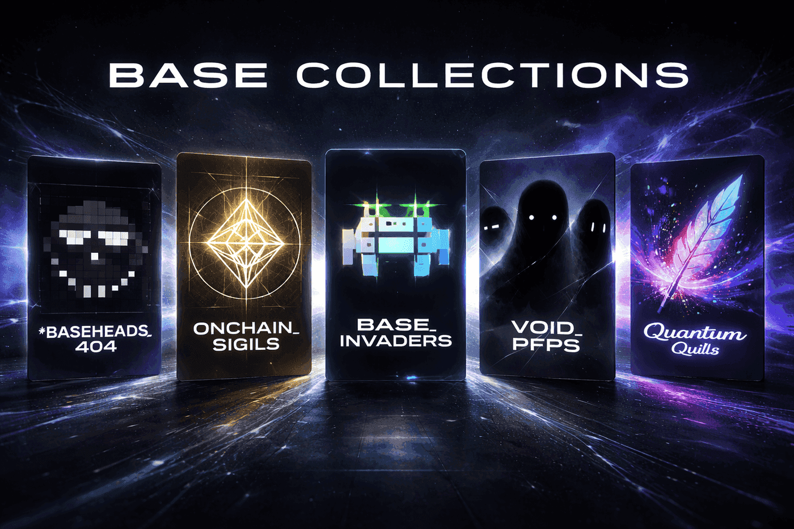

# Base Mint — NFT Battle Arena

A cross-collection NFT battle game built on **Base**. Any NFT, any collection — pick your fighter and enter the arena.

> 🏆 **Built for [Base Batches 003 Student Track](https://base-batches-student-track-3.devfolio.co/)**



## 🎮 Battle Arena

The flagship feature — a real-time turn-based battle system where NFTs from different collections fight each other.

- **Universal stat normalization** — every NFT (Base Invaders, BaseHeads 404, BaseMoods, VoidPFPs, etc.) is converted into a universal stat format (HP, ATK, DEF, SPD, CRIT, Dodge, Lifesteal, Regen)
- **Passive abilities** — Ghost Step, Iron Wall, Drain, Berserker, Regen Burst — each with cooldowns and trigger conditions
- **Animated combat** — particle effects, floating damage numbers, crit bursts, dodge ghosts, screen shake, slash trails, cinematic round splashes
- **AI opponents** — challenge AI-controlled fighters with configurable win rates
- **Anti-cheat snapshots** — stat snapshots with SHA-256 hashing to prevent drift abuse
- **Challenge board** — post challenges, accept fights, collection-themed card UI

## 📦 Platform Features

- **NFT Minting** — mint from curated Base collections with auto-discovery
- **Points & Gamification** — streaks, status badges, global leaderboards
- **Growth & Distribution** — automated social sharing, replay-to-play conversion, featured battle highlights
- **Analytics** — retention cohorts, conversion funnels, wallet insights
- **Social Sharing** — Farcaster cast composing, share cards, viral loops
- **Farcaster Mini App** — native integration with Farcaster frames

## 🛠️ Tech Stack

| Layer | Technology |
|---|---|
| Frontend | Vite, Vanilla JS, Tailwind CSS |
| Web3 | Reown AppKit, Wagmi, Viem, SIWE |
| Blockchain | Base (Mainnet) |
| Backend | Vercel Serverless Functions |
| Database | Vercel KV (Redis) |
| Hashing | Web Crypto API (SHA-256) |

## 🚀 Quick Start

### Prerequisites
- Node.js v18+
- WalletConnect Project ID ([Reown](https://cloud.reown.com))
- Vercel KV (Redis) for backend features

### Install & Run

```bash
# Install dependencies
npm install

# Run frontend only
npm run dev

# Run full app (frontend + serverless functions)
npm run dev:full
```

### Environment Variables

Create `.env` in project root:

```env
# WalletConnect
VITE_WALLETCONNECT_PROJECT_ID=your_reown_project_id

# Backend (Vercel KV)
KV_URL="redis://..."
KV_REST_API_URL="https://..."
KV_REST_API_TOKEN="..."
KV_REST_API_READ_ONLY_TOKEN="..."

# Security
JWT_SECRET=your_jwt_secret

# Admin Access
VITE_ADMIN_WALLETS=0x123...,0x456...
```

## 🏗️ Architecture

```
src/
├── components/game/       # Battle UI components
│   ├── ChallengeBoard.js  # Challenge listing with collection-themed cards
│   ├── MatchPreviewModal.js # VS split-screen with stat comparison
│   └── NFTSelectorModal.js  # Fighter picker with stat previews
├── lib/battle/            # Battle engine core
│   ├── balanceConfig.js   # Centralized stat caps, passives, tuning
│   ├── collectionProfiles.js # Collection definitions & trait mappings
│   ├── metadataNormalizer.js # Universal stat normalization
│   └── snapshot.js        # Browser-safe SHA-256 stat snapshots
├── lib/game/
│   ├── engine.js          # Turn-based combat engine with passive resolution
│   ├── arenaRenderer.js   # Animated battle renderer (particles, effects)
│   └── matchmaking.js     # Challenge KV store (V2 schema)
├── pages/                 # UI pages (home, mint, analytics, battle)
└── utils/                 # Shared utilities (DOM, social, router)
```

## 🎯 Supported Collections

| Collection | Role | Passive | Archetype |
|---|---|---|---|
| Base Invaders | Fighter | Ghost Step | Speed / Dodge |
| BaseHeads 404 | Fighter | Berserker | Aggro DPS |
| BaseMoods | Fighter | Regen Burst | Balanced / Healer |
| Void PFPs | Fighter | Ghost Step | Glass Cannon |
| Quantum Quills | Fighter | Drain | Sustain DPS |
| Base Fortunes | Fighter | Iron Wall | Tank |
| Neon Runes | Item Buff | — | V2 Modifier |
| Mini Worlds | Environment | — | V2 Modifier |

## 📸 Adding Collections

Collections are auto-discovered from `collections/*.js`:

```bash
# Sync collection index
npm run collections:sync
```

Auto-sync runs on `npm run dev`, `npm run build`, and `npm run dev:full`.

## 🔗 Links

- **Live App**: [base-mintapp.vercel.app](https://base-mintapp.vercel.app)
- **Devfolio**: [NFT Battle Arena](https://devfolio.co/projects/nft-battle-arena-e763)
- **Hackathon**: [Base Batches 003 Student Track](https://base-batches-student-track-3.devfolio.co/)

---

## ⚙️ How the Battle Engine Works

```
NFT Metadata → Normalizer → Universal Stats → Combat Engine → Animated Renderer
```

1. **Normalization** — Raw NFT traits (Faction, Mood, Body, etc.) are parsed through collection-specific `traitsMap` rules defined in `collectionProfiles.js`, producing a universal stat block (HP, ATK, DEF, SPD, CRIT, Dodge, Lifesteal, Regen).

2. **Stat Clamping** — All stats are bounded by centralized caps and floors from `balanceConfig.js` to prevent broken builds. E.g., HP max 300, CRIT max 75%, ATK min 3.

3. **Passive Resolution** — Each fighter gets a passive ability based on their collection (with trait-based overrides). Passives fire automatically during combat with cooldown tracking.

4. **Turn-Based Combat** — Higher SPD goes first. Each turn: regen → passive triggers → attack roll (crit/dodge checks) → lifesteal → damage application. Max 50 rounds.

5. **AI Rigging** — AI battles use a simulation loop (up to 25 seeds) to find a random timeline that matches the configured win rate (default 60%), making fights feel fair while keeping AI competitive.

6. **Snapshot Anti-Cheat** — Fighter stats are hashed (SHA-256) when a challenge is posted. Before a fight starts, the hash is re-verified to ensure no stat drift for mutable collections.

## 🎭 Passive Abilities

| Passive | Trigger | Effect | Cooldown |
|---|---|---|---|
| **Ghost Step** | On Defend | +25% dodge for 1 turn | 2 turns |
| **Iron Wall** | On Defend | -30% incoming damage for 1 turn | 3 turns |
| **Drain** | On Attack | Leech 20% of damage dealt as HP | 2 turns |
| **Berserker** | Below 30% HP | +40% ATK, -10% DEF | Always active |
| **Regen Burst** | Turn Start | Heal 8% of max HP | 3 turns |

## 🗺️ Roadmap

### ✅ Phase 1 — Unified Arena MVP 
- [x] Cross-collection stat normalization (12+ collections)
- [x] Turn-based auto-combat engine
- [x] 5 passive abilities with cooldown system
- [x] Cinematic battle renderer (particles, damage numbers, screen shake)
- [x] Challenge board with AI opponents
- [x] VS screen with stat comparison
- [x] NFT fighter selector with stat previews

### ✅ Phase 2 — V2 Advanced & PvP (Current)
- [x] Multi-NFT loadouts (Fighter + Item + Arena modifiers)
- [x] Wallet inventory parsing for Team Synergies
- [x] SIWE (Sign-In with Ethereum) JWT authentication
- [x] PvP match resolution via server-side APIs (Vercel KV)
- [x] Deterministic seeded PRNG for shareable battle replays
- [x] Snapshot anti-cheat system (Server verified)
- [x] V2 Analytics tracking (`battle_loadout_built`, `battle_started_v2`, `battle_result_v2`)
- [x] Auth cleanup on wallet disconnect (`clearBattleAuth`)
- [x] Live balance configuration fetching via CDN (with bundled fallback)
- [ ] Spectator Mode — shareable battle replay URLs

### 🔜 Phase 3 — Multiplayer & Social
- [ ] Real-time PvP matchmaking with WebSocket
- [ ] Battle replays — shareable animated GIFs
- [ ] On-chain battle result logging (Base smart contract)
- [ ] Add more Base NFT collections to the battle roster
- [ ] Collection search by name and contract address

### 🔮 Phase 4 — Platform Expansion
- [ ] Multi-NFT team battles (3v3 with synergy bonuses)
- [ ] More game modes (tournament brackets, seasons, wagered battles)
- [ ] Marketplace tab — browse, buy, sell, make offers via OpenSea API
- [ ] Token-gated features and rewards
- [ ] Cross-chain collection support (Ethereum → Base bridge)
- [ ] Mobile-optimized battle experience

### 💡 Future Vision
Base Mint evolves into a **full NFT gaming platform on Base** — where any NFT from any collection has utility through games, trading, and social features. The battle arena is the first module; marketplace and additional game modes follow.

## 🤝 Contributing

1. Fork the repo
2. Create a feature branch (`git checkout -b feature/awesome`)
3. Commit changes (`git commit -m 'Add awesome feature'`)
4. Push and open a PR

## 📄 License

MIT
